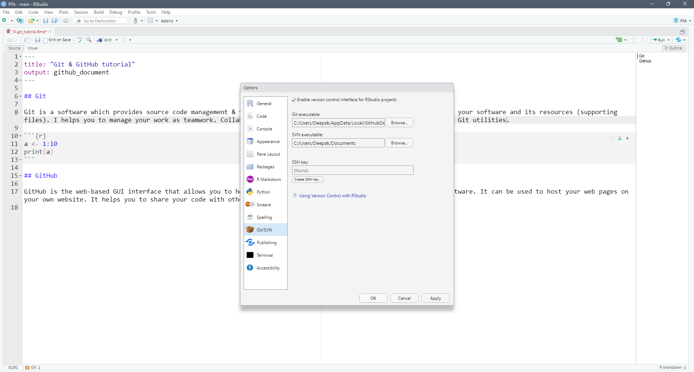
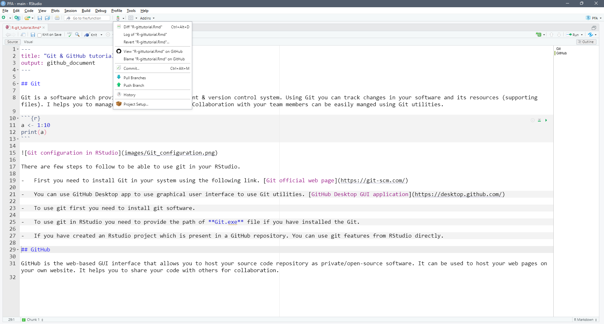

Git & GitHub tutorial
================

## Git

Git is a software which provides source code management & version
control system. Using Git you can track changes in your software and its
resources (supporting files). It helps you to manage your work with a
team. Collaboration with your team members can be easily manged using
Git utilities.

There are few steps to follow to be able to use git in your RStudio.

- First you need to install Git in your system using the following link.
  [Git official web page](https://git-scm.com/)

- You can use GitHub Desktop app to use graphical user interface to use
  Git utilities. [GitHub Desktop GUI
  application](https://desktop.github.com/)

- To use git in RStudio you need to provide the path of **Git.exe** file
  if you have installed the Git.

- Git can also be used using command line interface using RStudio
  terminal if you have configured it correctly.

  

- If you have created an Rstudio project which is present in a GitHub
  repository. You can use git utilities using its GUI from RStudio
  directly.

## GitHub

GitHub is the web-based GUI interface that allows you to host your
source code repository as private/open-source software. It can be used
to host your web pages on your own website. It helps you to share your
code with others for collaboration.

With one click you can commit changes to your files. One click can push
it to the remote (Your repository on GitHub)

